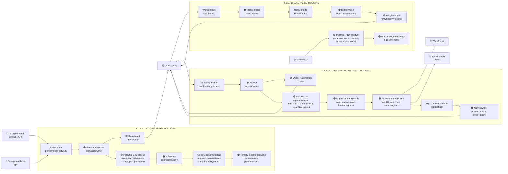

# Event Storming – Floowe

> **Metodologia:** Event Storming (Alberto Brandolini) 
> Technika eksploracji złożonych domen biznesowych poprzez identyfikację zdarzeń domenowych i ich powiązań z komendami, aktorami oraz systemami zewnętrznymi.

---

## Legenda

| Symbol / Kolor | Znaczenie | Opis |
|---|---|---|
| 🟠 **Zdarzenie domenowe** | Domain Event | Coś, co się wydarzyło w przeszłości (past tense). Fakt w domenie. |
| **Komenda** | Command | Intencja – akcja wywołana przez aktora lub system. Wywołuje zdarzenie. |
| 🟡 **Aktor** | Actor | Użytkownik lub zewnętrzny system, który wydaje komendę |
| 🩷 **System zewnętrzny** | External System | Integracja poza domeną Floowe |
| 🟣 **Polityka / Reakcja** | Policy | Reguła biznesowa: "Gdy zdarzenie X → wykonaj komendę Y" |
| 🟢 **Read Model** | Read Model / View | Dane odczytywane przez aktora do podjęcia decyzji |

---

## AS-IS (Stan Bieżący)

```mermaid
flowchart LR
 %% Actors
 USER["🟡 Użytkownik"]
 AI_SYS["🟡 System AI\n(LLM)"]
 EXT_WP["🩷 WordPress\n(plugin)"]
 EXT_FB["🩷 Facebook\nGraph API"]
 EXT_LI["🩷 LinkedIn\nMarketing API"]
 EXT_X["🩷 X / Twitter\nAPI"]

 %% === REJESTRACJA ===
 subgraph REG["REJESTRACJA & KONFIGURACJA"]
 direction TB
 CMD_REG[" Zarejestruj konto"]
 EVT_REG["🟠 Konto utworzone"]
 CMD_PROFILE[" Skonfiguruj profil\nbiznesowy"]
 EVT_PROFILE["🟠 Profil\nskonfigurowany"]
 CMD_CONNECT[" Połącz kanały\nsocial media"]
 EVT_CONNECTED["🟠 Kanały\npodłączone"]
 end

 %% === GENEROWANIE ===
 subgraph GEN["GENEROWANIE TREŚCI"]
 direction TB
 CMD_IDEAS[" Zleć generowanie\npomysłów"]
 EVT_IDEAS["🟠 Pomysły na artykuły\nwygenerowane"]
 RM_IDEAS["🟢 Lista tematów\ndo wyboru"]
 CMD_SELECT[" Wybierz temat\nartykułu"]
 EVT_TRIGGER["🟠 Generowanie artykułu\nuruchomione"]
 CMD_GENERATE[" Generuj artykuł\n(AI + SEO)"]
 EVT_GENERATED["🟠 Artykuł\nwygenerowany"]
 end

 %% === EDYCJA ===
 subgraph EDIT["EDYCJA & ZATWIERDZANIE"]
 direction TB
 RM_DRAFT["🟢 Draft artykułu\nw edytorze"]
 CMD_EDIT[" Edytuj artykuł"]
 EVT_EDITED["🟠 Artykuł\nzmodyfikowany"]
 CMD_IMG[" Wybierz grafikę"]
 EVT_IMG["🟠 Grafika\nprzypisana"]
 end

 %% === PUBLIKACJA ===
 subgraph PUB["PUBLIKACJA & DYSTRYBUCJA"]
 direction TB
 CMD_PUBLISH[" Opublikuj treść"]
 EVT_WP["🟠 Artykuł opublikowany\nna stronie WWW"]
 EVT_SOC["🟠 Posty social media\nowygenerowane i opublikowane"]
 POL_SOC["🟣 Polityka: Przy publikacji\nartykułu → auto-generuj\ni opublikuj posty SM"]
 end

 %% Flow
 USER --> CMD_REG --> EVT_REG
 EVT_REG --> CMD_PROFILE --> EVT_PROFILE
 EVT_PROFILE --> CMD_CONNECT --> EVT_CONNECTED

 EVT_CONNECTED --> CMD_IDEAS
 AI_SYS --> EVT_IDEAS
 CMD_IDEAS --> EVT_IDEAS --> RM_IDEAS
 RM_IDEAS --> CMD_SELECT --> EVT_TRIGGER
 EVT_TRIGGER --> CMD_GENERATE --> EVT_GENERATED

 EVT_GENERATED --> RM_DRAFT
 RM_DRAFT --> CMD_EDIT --> EVT_EDITED
 EVT_EDITED --> CMD_IMG --> EVT_IMG

 EVT_IMG --> CMD_PUBLISH
 CMD_PUBLISH --> EVT_WP --> EXT_WP
 CMD_PUBLISH --> POL_SOC --> EVT_SOC
 EVT_SOC --> EXT_FB
 EVT_SOC --> EXT_LI
 EVT_SOC --> EXT_X
```

### Kluczowe Zdarzenia AS-IS

| # | Zdarzenie Domenowe | Wyzwalacz | Rezultat |
|---|---|---|---|
| 1 | **Konto utworzone** | Rejestracja użytkownika | Aktywacja konta, start okresu próbnego |
| 2 | **Profil skonfigurowany** | Użytkownik podaje dane firmy i branżę | AI ma kontekst do generowania treści |
| 3 | **Kanały podłączone** | OAuth z Facebook/LinkedIn/X | Możliwość auto-publikacji |
| 4 | **Artykuł wygenerowany** | Wywołanie LLM z kontekstem SEO + profilu | Draft artykułu dostępny w edytorze |
| 5 | **Treść opublikowana** | Komenda publikacji | Artykuł na WWW + posty SM |

---

## TO-BE (Stan Przyszły z Nowymi Funkcjonalnościami)

Proponowane funkcje:
- **F1:** Analytics & Performance Feedback Loop
- **F2:** AI Brand Voice Training 
- **F3:** Content Calendar & Smart Scheduling

### Nowe Zdarzenia TO-BE

| # | Zdarzenie Domenowe | Funkcja | Co zmienia w systemie |
|---|---|---|---|
| 6 | **Dane analityczne zaktualizowane** | F1 – Analytics | System wie, które treści generują ruch i konwersje |
| 7 | **Follow-up zaproponowany** | F1 – Analytics | AI zamyka feedback loop – generuje kolejne treści na bazie sukcesu |
| 8 | **Brand Voice Model wytrenowany** | F2 – Brand Voice | Każdy przyszły artykuł będzie brzmiał jak marka użytkownika |
| 9 | **Artykuł zaplanowany** | F3 – Calendar | System przejmuje odpowiedzialność za timing publikacji |
| 10 | **Artykuł automatycznie opublikowany wg harmonogramu** | F3 – Calendar | Pełna automatyzacja bez udziału użytkownika |

---

## Kluczowi Aktorzy i Systemy

| Aktor / System | Rola | AS-IS | TO-BE |
|---|---|---|---|
| **Użytkownik** | Inicjuje akcje, edytuje treści | | |
| **System AI (LLM)** | Generuje treści i pomysły | | + Brand Voice |
| **WordPress Plugin** | Publikacja na stronie WWW | | + scheduled posts |
| **Facebook/LinkedIn/X API** | Dystrybucja do social media | | + scheduled |
| **Google Search Console** | Dane o pozycjach w Google | | (F1) |
| **Google Analytics** | Dane o ruchu i zachowaniu użytkowników | | (F1) |
| **Scheduler (Cron/Queue)** | Planowanie i automatyczne wyzwalanie zadań | | (F3) |
| **Notification Service** | Powiadomienia email/push | | (F3) |
